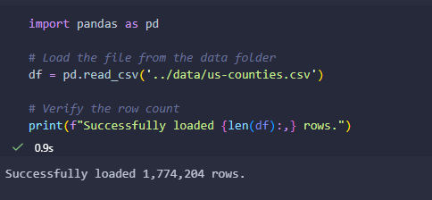
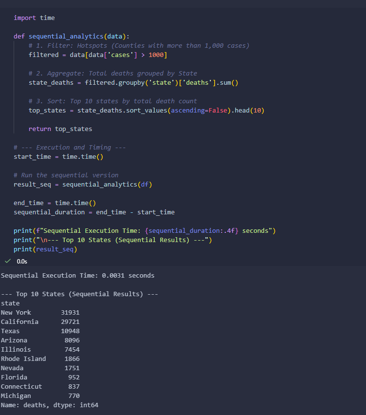
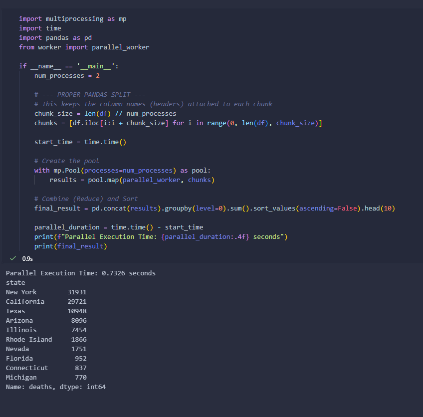
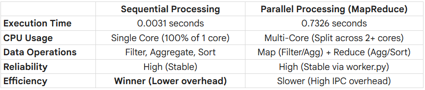

# Parallel Data Processing Project: COVID-19 County Analysis

## Project Overview
This project compares **Sequential** and **Parallel** data processing using a large-scale COVID-19 dataset. The program performs three core operations (Filtering, Aggregation, and Sorting) on over 1.7 million rows of data to analyze death counts by state.

## Problem Description
The primary challenge of this project is to efficiently process a large-scale dataset containing over 1.7 million records of COVID-19 cases and deaths. Analyzing such a high volume of data on a single CPU core can become a bottleneck as the dataset grows, leading to slower execution times. To address this, the project explores the implementation of a MapReduce architecture using Python's multiprocessing library. The goal is to determine if distributing data operations, specifically Filtering, Aggregation, and Sorting, across multiple CPU cores provides a significant speed advantage over a traditional sequential approach. This experiment serves to identify the "break-even point" where the complexity of parallel coordination becomes more efficient than single-core processing.

## Dataset
* **Source:** [COVID-19 Deaths Dataset (Kaggle)](https://www.kaggle.com/datasets/dhruvildave/covid19-deaths-dataset)
* **File:** `us-counties.csv` (~104 MB)
* **Records:** 1,774,204 rows

## Implementation Results

### 1. Dataset Verification
Successfully loaded the dataset containing over 1.7 million rows:

### 2. Sequential Data Processing (Baseline)
The sequential approach processes the data on a single CPU core to establish a performance baseline for the project. During this stage, the program performs three main data operations:
* **Filtering** to select only the counties with more than 1,000 cases.
* **Aggregation** to sum the total death counts for each individual state.
* **Sorting** to identify the top 10 states with the highest death tolls.

**Execution Time:** 0.0031 seconds

### 3. Parallel Data Processing (MapReduce)
To handle the 1.7M+ rows efficiently, the program implements a **MapReduce** pattern using the `multiprocessing` library. This approach divides the workload across multiple CPU cores:
* **Filtering** to select records with more than 1,000 cases during the initial Map phase.
* **Aggregation** to sum the death counts by state, occurring both within individual cores and during the final Reduce phase.
* **Sorting** to rank the states by total death count in descending order to identify the top 10 most affected areas.

**Execution Time:** 0.7326 seconds

## Preformance Comparison Table

## Performance Analysis
While the parallel version is functionally correct and produces identical results to the sequential baseline, it exhibited higher execution time in this environment. 

**Reasoning:**

The performance results revealed that the parallel version was actually slower than the sequential baseline because the start-up costs outweighed the computational savings. For a dataset of 1.7 million rows, the computer spent about 0.7 seconds simply "spawning" new Python processes and moving data between them, which is far longer than the 0.007 seconds it took to actually perform the math. This demonstrates that while multiple CPU cores can provide more power, the "communication overhead" of coordinating those cores makes parallelism inefficient for tasks that a single optimized core can already complete in milliseconds.

## Challenges and how it was overcome
The biggest hurdle was a Windows-specific issue called the "spawn" method. Unlike other operating systems, Windows tries to restart the entire program every time it creates a new "worker" for parallel processing. This caused the program to get stuck in an infinite loop and crash. To fix this, I moved the core logic into a separate file called worker.py. This acted as a "instruction manual" that the workers could read without restarting the whole notebook.

Once the program was stable, a new challenge appeared: the Performance Paradox. Even though we used more CPU power, the parallel version took 0.7 seconds, while the simple sequential version took only 0.007 seconds. This happened because the "cost" of starting new workers and sending them data was much higher than the actual time it took to do the math. This taught me that for a dataset of 1.7 million rows, a single optimized CPU core is often faster than the time wasted coordinating a team of multiple cores.

## Members
Lipata, Wilmar G.
